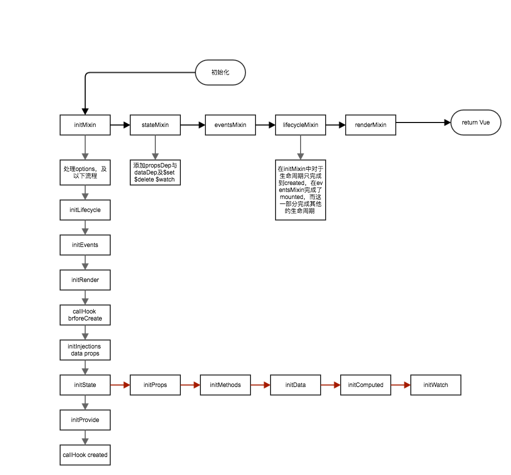
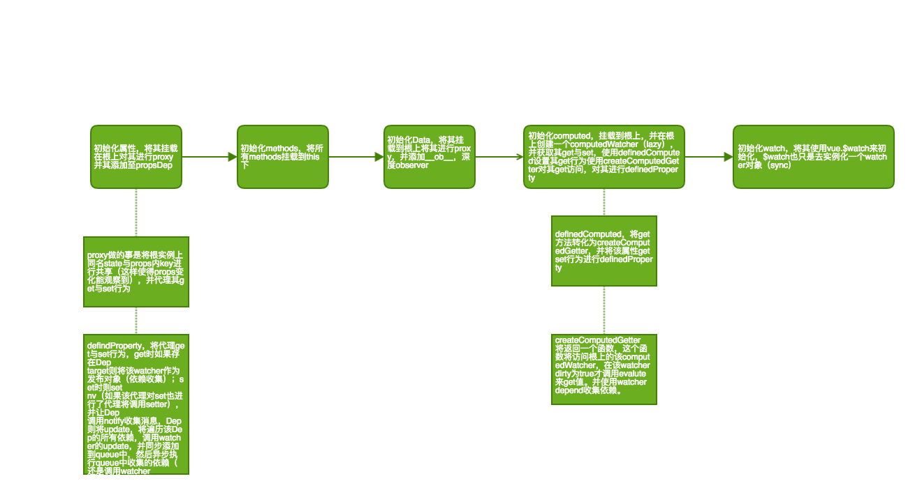
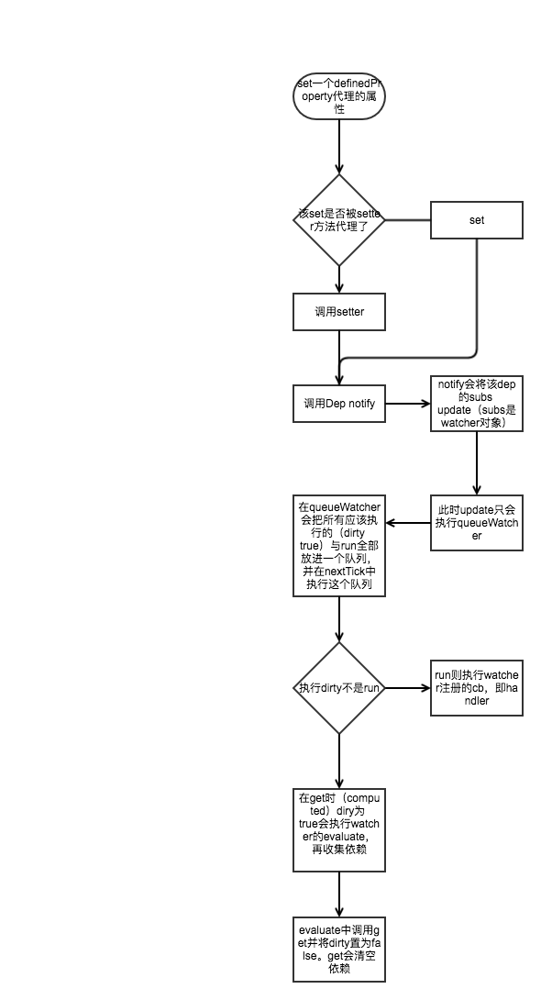

## 为什么是Vue？
1. 轻量级mvvm框架，将开发者从繁琐的dom操作中释放出来
2. 强大的数据跟踪机制，将state与state，state与vnode建立依赖关系，实现一套强大的订阅发布机制
3. vnode中间层，将state与dom通过vnode建立联系，最小粒度最小范围的更新必要的dom

不服跑个分？[传送门](https://rawgit.com/krausest/js-framework-benchmark/master/webdriver-ts/table.html)

## 笔记
[vue文档](vue.md)  
[vueRouter文档](vuerouter.md)  
[vuex文档](vuex.md)  
[vueTouch文档](vuetouch.md)

## vue
#### 大纲
  
#### initState
  
#### dep,definedProperty,watcher如何工作的？
  
